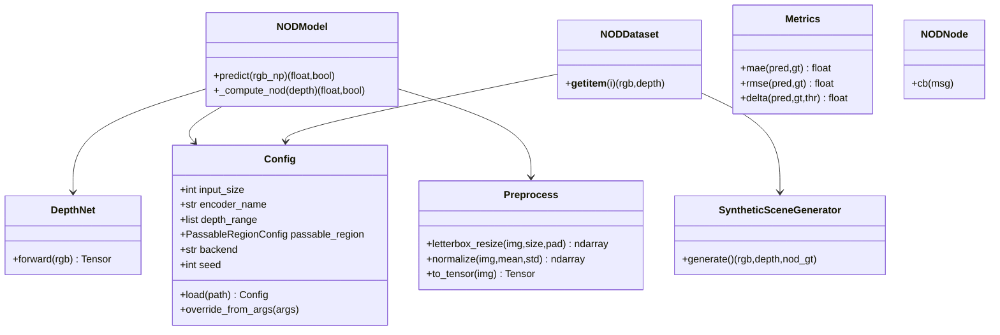

# 架构设计文档（ARCHITECTURE）：单目前向 NOD 基线

## 1. 总体选型

采用 **PyTorch** 三段式流水线：

1. **训练（开发机）**：合成/真实数据 → `DepthNet` 训练 → `models/ckpt.pt`，并断言参数量 < 30M。
2. **导出（开发机）**：`export_onnx.py` 固定张量名 `input_rgb [1,3,224,224]` / `output_depth [1,1,224,224]` 导出 ONNX。
3. **推理（Jetson）**：ONNX → `build_trt.py` 构建 FP16 TensorRT 引擎 `models/model.trt`；`NODModel` 支持 `torch / onnx / trt` 后端切换。

## 2. 文件树与 NOD 编号映射

```
perception/obstacle_distance/
├── README.md
├── requirements.txt / requirements_jetson.txt
├── .gitignore
├── Dockerfile
├── configs/default.yaml          # NOD-002/003/004 参数单一来源
├── src/
│   ├── config.py                 # Config.load / override_from_args
│   ├── preprocess.py             # NOD-002 letterbox + normalize
│   ├── model/network.py          # DepthNet (MobileNetV3-small + 解码器) NOD-007
│   ├── model/nod_model.py        # NODModel.predict -> (distance_m, has_obstacle) NOD-001/003/005/010
│   ├── data/synthetic.py         # 程序化合成 RGB+深度 NOD-008
│   ├── data/dataset.py           # NODDataset.__getitem__ 契约 NOD-008
│   ├── train.py                  # 训练 + 参数量断言 NOD-007
│   ├── export_onnx.py            # ONNX 导出 NOD-009
│   ├── build_trt.py              # TensorRT 构建(Jetson) NOD-009
│   ├── infer.py                  # CLI 推理
│   ├── metrics.py                # MAE/RMSE/δ NOD-006
│   ├── download_model.sh         # juicefs 拉取权重/引擎
│   └── node.py                   # ROS2 节点桩 + judgeflow 集成点 NOD-010
├── scripts/benchmark.py          # 时延/帧率/GPU 基准 NOD-009
├── scripts/eval.py               # 评测入口 NOD-006
└── tests/                        # pytest 套件（torch 用 importorskip 跳过）
```

## 3. 类图（Mermaid）



## 4. 时序图

**训练**：`train.py` → `NODDataset` → `DepthNet` → loss(L1+尺度不变) → 保存 `ckpt.pt`。

**推理**：`infer.py`/`node.py` → `NODModel.predict` → `preprocess` → `DepthNet`(或 ONNX/TRT) → `_passable_mask` → `min` → `clamp` → `(distance_m, has_obstacle)`。

**导出**：`export_onnx.py` → 加载 `ckpt.pt` → `torch.onnx.export` → `models/model.onnx`（张量名 `input_rgb`/`output_depth`）。

**评测集成**：`eval.py` → `NODModel` + `NODDataset` → `metrics(MAE/RMSE/δ)` → 报告。

## 5. 任务列表（T1–T15，含依赖）

- T1 `configs/default.yaml` + `src/config.py`（无依赖）
- T2 `src/preprocess.py`（依赖 T1）
- T3 `src/model/network.py`（依赖 T1）
- T4 `src/model/nod_model.py`（依赖 T1,T2,T3）
- T5 `src/data/synthetic.py`（依赖 T1）
- T6 `src/data/dataset.py`（依赖 T1,T5）
- T7 `src/metrics.py`（无依赖）
- T8 `src/train.py`（依赖 T1,T3,T6）
- T9 `src/export_onnx.py`（依赖 T1,T3）
- T10 `src/build_trt.py`（依赖 T9，仅 Jetson）
- T11 `src/infer.py`（依赖 T1,T4）
- T12 `src/node.py`（依赖 T1,T4）
- T13 `scripts/benchmark.py`（依赖 T1,T4）
- T14 `scripts/eval.py`（依赖 T1,T4,T6,T7）
- T15 `tests/*` + `Dockerfile` + `requirements*`（依赖全部）

## 6. 依赖（分列）

**开发机**：numpy, opencv-python-headless, torch, torchvision, pyyaml, onnx, onnxruntime, pynvml, pytest。

**Jetson（Orin-16G）**：numpy, opencv-python-headless, pyyaml, onnx, onnxruntime, tensorrt(+CUDA/cuDNN 由 JetPack 提供), rclpy(ROS2, apt), torch(用 JetPack 预编译 wheel，勿 pip 覆盖)。

## 7. 跨文件约定（11 条）

1. 距离单位：米（float）。
2. 图像：RGB / HWC / uint8。
3. Config 单一来源，禁止硬编码。
4. 统一 `logging`，模块级 logger。
5. 包根 `src`，`src/__init__.py` 暴露顶层 API。
6. 哨兵：`+inf` / `False` 表示无障碍（禁止 0）。
7. ONNX 张量名：`input_rgb` / `output_depth`。
8. 随机种子：42。
9. 深度 clamp：[0.1, 30.0]。
10. 相对路径以 `configs/` 所在目录为根解析。
11. torch 相关测试用 `pytest.importorskip("torch")` 以便无 torch 环境跳过。

## 8. 架构待明确（8 条）

1. 真实数据接入格式与标注协议。
2. 无障碍判定的语义边界（是否需要独立分类头）。
3. δ 阈值与指标权重。
4. judgeflow 协议细节。
5. TensorRT 精度策略（FP16/INT8）。
6. juicefs 版本/校验规范。
7. 多相机/多分辨率扩展。
8. 端到端时延的正式 benchmark 环境（Jetson 实测）。
